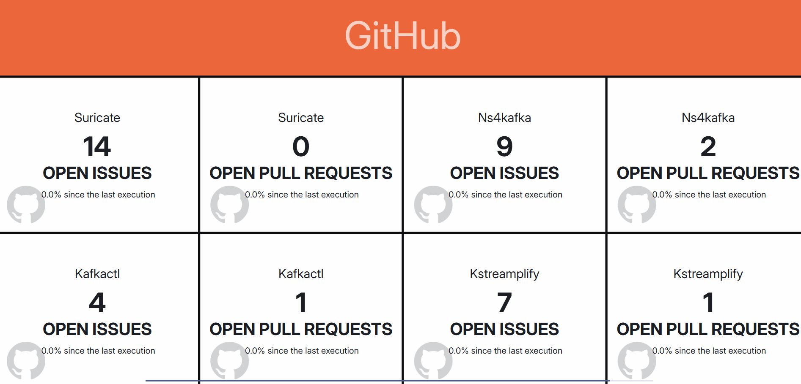

# Suricate

<div align="center">
  
</div>

[](https://img.shields.io/github/actions/workflow/status/michelin/suricate/continuous_integration.yml)
[](https://github.com/michelin/suricate/releases)
[](https://github.com/michelin/suricate/commits/master)
[](https://github.com/michelin/suricate)
[](https://github.com/michelin/suricate)
[](https://hub.docker.com/r/michelin/suricate/tags)
[](https://hub.docker.com/r/michelin/suricate)
[](https://sonarcloud.io/component_measures?id=michelin_suricate&metric=coverage&view=list)
[](https://sonarcloud.io/component_measures?metric=tests&view=list&id=michelin_suricate)
[](https://opensource.org/licenses/Apache-2.0)

This repository contains the source code of the Suricate application.



## Table of Contents

* [Download](#download)
* [Install](#install)
* [Configuration](#configuration)
    * [Default Configuration](#default-configuration)
    * [Database](#database)
    * [Authentication](#authentication)
      * [LDAP vs Database](#ldap-vs-database)
      * [Social Login](#social-login)
        * [GitHub](#github)
        * [GitLab](#gitlab)
        * [Redirection to Front-End](#redirection-to-front-end)
        * [Name Parsing Strategy](#name-parsing-strategy)
      * [Personal Access Token](#personal-access-token)
    * [Widgets](#widgets)
      * [Encryption](#encryption)
      * [Repositories](#repositories)
* [Swagger UI](#swagger-ui)
* [Contribution](#contribution)

## Download

You can download Suricate as a fat jar from the project's releases page on GitHub
at https://github.com/michelin/suricate/releases. 

Please note that Java 21 is required starting from Suricate 2.8.0 (Java 8 before).

Additionally, a Docker image of the solution is available at https://hub.docker.com/repository/docker/michelin/suricate.

## Install

Suricate is built on the [Spring Boot framework](https://spring.io/) and can be configured using a Spring Boot
configuration file, which includes a sample file located at `src/main/resources/application.properties`.

If necessary, you can override the properties from the default `application.properties` file by following
the [Spring Boot externalized configuration guide](https://docs.spring.io/spring-boot/docs/1.4.1.RELEASE/reference/html/boot-features-external-config.html).
For example, you can create a custom  `/config/application.properties` or set the `--spring.config.location` system
property when running the fat jar file:

```console
java -Dpolyglotimpl.DisableClassPathIsolation=true -jar suricate.jar --spring.config.location=classpath:\,file:C:\myCustomLocation\
```

The `-Dpolyglotimpl.DisableClassPathIsolation=true` option is required to
run [Polyglot]((https://www.graalvm.org/jdk21/reference-manual/embed-languages/))
properly ([more details](https://github.com/oracle/graal/issues/7625)).

Alternatively, you can use the provided docker-compose file to run the application and use a volume to override the
default properties:

```console
docker-compose up -d
```

After running the command, the application will be accessible on http://localhost:8080/.

## Configuration

### Default Configuration

By default, Suricate:

- runs on a H2 file database
- provides a sign-in/sign-up authentication mode based on the database

### Database

Suricate supports running on different DBMS. Currently, the following DBMS are supported:

- H2
- PostgreSQL

You can define the DBMS you want to use in the `application.properties` file with the `spring.profiles.active`
parameter:

```yaml
spring.profiles.active: ### Provider should be 'h2' or 'postgresql'
```

The matching `application-DBMS.properties` file will be picked up.

In the matching `application-DBMS.properties`, fill in the datasource properties:

```yaml
spring.datasource.url:
spring.datasource.username:
spring.datasource.password:
```

Please note that the `application-DBMS.properties` files activate Flyway to automatically set up the database
structure (tables, constraints, etc.) and the minimum required functional data.

### Authentication

Suricate provides multiple types of authentication that can be activated or deactivated based on your requirements.

All the authentication modes deliver a JWT token that is used to authenticate the user on the Back-End.
You can configure the JWT token using the following properties:

```yaml
application.authentication.jwt.signingKey: 'changeitchangeitchangeitchangeit'
application.authentication.jwt.tokenValidityMs: 86400000
```

The signing key should be at least 256 bits long (since Suricate v2.8.0) and should be changed for each environment.

#### Database

You can log in to Suricate using the database after the sign-up step.

You can choose this authentication mode using the following YAML property:

```yaml
application.authentication.provider: 'database'
```

#### LDAP

You can log in to Suricate an LDAP. 

You can choose this authentication mode using the following YAML property:

```yaml
application.authentication.provider: 'ldap'
```

If you choose the ldap authentication mode, you must specify the following additional properties:

```yaml
application.authentication.ldap.url:
application.authentication.ldap.userSearchFilter:
application.authentication.ldap.firstNameAttributeName:
application.authentication.ldap.lastNameAttributeName:
application.authentication.ldap.mailAttributeName:
application.authentication.ldap.username:
application.authentication.ldap.password:
application.authentication.ldap.userSearchBase:
application.authentication.ldap.userDnPatterns:
```

#### Social Login

Suricate supports authentication with GitHub and GitLab. You can configure social login using
the `application-social-login.properties` file, which you can activate by running the application with
the `social-login` profile.

When you activate social login, you can activate or deactivate a social login mode by adding or removing it from the
property:

```yaml
application.authentication.socialProviders: gitlab,github
```

##### GitHub

To log in using GitHub, you must specify the following properties:

```yaml
spring.security.oauth2.client.registration.github.client-id: <github_client_id>
spring.security.oauth2.client.registration.github.client-secret: <github_client_id>
```

##### GitLab

To log in using GitLab with OIDC, you must specify the following properties:

```yaml
spring.security.oauth2.client.registration.gitlab.client-id: <gitlab_client_id>
spring.security.oauth2.client.registration.gitlab.client-secret: <gitlab_client_secret>
spring.security.oauth2.client.registration.gitlab.authorization-grant-type: authorization_code
spring.security.oauth2.client.registration.gitlab.redirect-uri: http://localhost:8080/login/oauth2/code/gitlab
spring.security.oauth2.client.provider.gitlab.issuer-uri: https://gitlab.com
spring.security.oauth2.client.registration.gitlab.scope: read_user,openid,profile,email
```

To log in using GitLab with OAuth2, you must specify the following properties:

```yaml
spring.security.oauth2.client.registration.gitlab.client-id: <gitlab_client_id>
spring.security.oauth2.client.registration.gitlab.client-secret: <gitlab_client_secret>
spring.security.oauth2.client.registration.gitlab.authorization-grant-type: authorization_code
spring.security.oauth2.client.registration.gitlab.redirect-uri: http://localhost:8080/login/oauth2/code/gitlab
spring.security.oauth2.client.provider.gitlab.issuer-uri: https://gitlab.com
spring.security.oauth2.client.registration.gitlab.scope: read_user
spring.security.oauth2.client.provider.gitlab.user-info-uri: https://gitlab.com/api/v4/user
spring.security.oauth2.client.provider.gitlab.user-name-attribute: username
```

##### Redirection to Front-End

The social login is based on OAuth2/OIDC and is handled by the Back-End. After a successful or failed authentication
with a social network, the Back-End redirects to the Front-End.

The Back-End uses the following methods to redirect to the Front-End in this order:

- A given _redirect_uri_ query parameter provided by the Front-End to the Back-End in the authorization request (
  e.g., http://localhost:8080/api/oauth2/authorization/github?redirect_uri=/login). 
  The host can even be different (e.g., http://localhost:8080/api/oauth2/authorization/github?redirect_uri=http://localhost:4200/login)
- The referer in this authorization, but it can be hidden or lost after a redirection to the ID provider.
- A default target URL defined in the Back-End.

The first option is currently used.

The other options are defined by the following properties:

```yaml
application.authentication.oauth2.defaultTargetUrl: http://localhost:4200/login
application.authentication.oauth2.useReferer: false
```

##### Name Parsing Strategy

By default, Suricate parses the user's first name and last name from the ID provider using the format "Firstname
Lastname". However, you can also configure Suricate to parse the first name and last name based on the case (
upper/lower) using the following property:

```yaml
application.authentication.socialProvidersConfig.<provider>.nameCaseParse: true
```

Simply replace `<provider>` with the appropriate social provider, such as `github` or `gitlab`.

#### Personal Access Token

The application allows for the generation of personal access tokens, which can be used for authentication. The following
properties are used for token generation and verification:

```yaml
application.authentication.pat.prefix: sup
application.authentication.pat.checksumSecret: changeit
```

It is recommended to update the _checksumSecret_ with a different secret for each environment, to enhance security.

The _prefix_ is used by the application to identify the token type and parse it.

### Widgets

Here is given the guidelines to configure the widgets.

#### Encryption

Sensitive widget parameters such as passwords or tokens are encrypted in the database. 
You must change the encryption key for each environment using the following property: 

```yaml
jasypt.encryptor.password: changeitchangeitchangeitchangeit
```

#### Repositories

The first time you start the application, you'll need to configure a repository of widgets. To do this, navigate to the
repositories tab and add a new repository. You can choose to add either a local or remote repository (such as GitLab or
GitHub).

If you don't have a repository yet, you can create your own widgets repository by following the instructions provided
in [the official open-source widgets GitHub repository](https://github.com/michelin/suricate-widgets), or use this
repository directly.

To configure this repository in Suricate, use the following settings:

```yaml
Name: [ Enter a name of your choice ]
URL: https://github.com/michelin/suricate-widgets.git
branch: master
login: [ Your GitHub login ]
password: [ Your GitHub password ]
```

## Swagger UI

Suricate provides a Swagger UI to test the API. You can access it at http://localhost:8080/swagger-ui/index.html.

You can authenticate using the `POST /api/v1/auth/signin` endpoint and then use the `Authorize` button to add the
JWT token in the `Authorization` header.

> Note: The authentication through social login is not supported yet by the Swagger UI.

## Contribution

We welcome contributions from the community! Before you get started, please take a look at
our [contribution guide](https://github.com/michelin/suricate/blob/master/CONTRIBUTING.md) to learn about our guidelines
and best practices. We appreciate your help in making Suricate a better tool for everyone.
