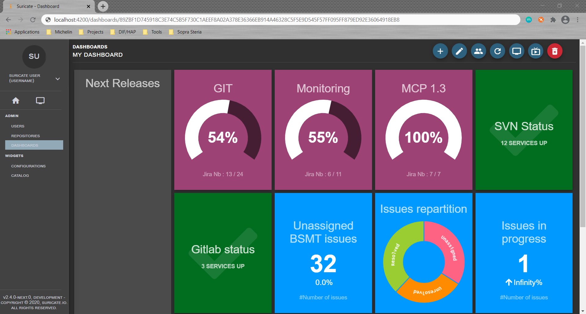

# Suricate 

This repository contains the source code of the Suricate application.

## 📚 Wiki

Instructions for setting up and self-hosted the application are located in [the brand-new wiki](https://github.com/suricate-io/suricate/wiki) 🙌 !

## :beers: Contribution

Everyone is welcome to contribute. Here's how:

- Report a [bug](https://github.com/suricate-io/suricate/issues/new?assignees=&labels=bug&template=bug_report.md&title=) 🐛
- Suggest a [feature](https://github.com/suricate-io/suricate/issues/new?assignees=&labels=enhancement%2C+new+feature&template=feature-request.md&title=) 💡
- Develop a feature and create a [pull request](https://github.com/suricate-io/suricate/pulls) 💻

Please read our [contribution guide](https://github.com/suricate-io/suricate/blob/dev/CONTRIBUTING.md) before contributing 🙏
